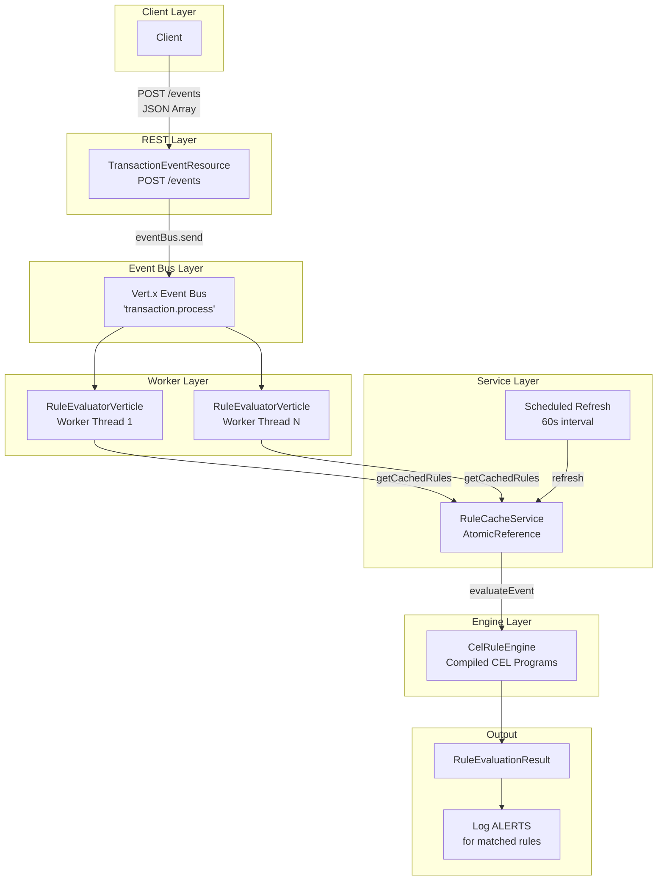

# EDIOS

**Event-Driven Ingestion & Observability System**

High-throughput Quarkus 3.x application for real-time transaction event ingestion with Google CEL rule evaluation.

Built by [duttgirish](https://github.com/duttgirish)

---

## Architecture



**Key design principles:**
- Non-blocking REST endpoint returns 202 immediately, processes asynchronously via Vert.x Event Bus
- CEL expressions are pre-compiled at cache refresh for fast evaluation
- Thread-safe rule cache with atomic volatile swap during recompilation
- Virtual threads (Java 21) for efficient blocking operation handling

---

## Technology Stack

| Layer | Technology |
|-------|------------|
| Framework | Quarkus 3.17.0 |
| Java | JDK 21 (Virtual Threads) |
| REST | RESTEasy Reactive |
| Async | Vert.x Event Bus |
| Rule Engine | Google CEL 0.11.1 |
| Database | Reactive MariaDB/MySQL Client |
| JSON | Jackson |
| Health | MicroProfile Health |
| Testing | JUnit 5, REST Assured |

---

## Quick Start

### Prerequisites
- JDK 21+
- Maven 3.9+ (or use the included `mvnw` wrapper)

### Run in Development Mode

```bash
./mvnw quarkus:dev
```

### Build & Package

```bash
./mvnw package
java -jar target/quarkus-app/quarkus-run.jar
```

### Build Native Executable (requires GraalVM)

```bash
./mvnw package -Pnative
```

### Run Tests

```bash
./mvnw test
```

---

## API Endpoints

### POST /events
Ingest transaction events for rule evaluation.

```bash
curl -X POST http://localhost:8080/events \
  -H "Content-Type: application/json" \
  -d '[
    {
      "debitAccount": "ACC-001",
      "creditAccount": "ACC-002",
      "cin": "CIN-12345",
      "amount": 15000.00,
      "transactedTime": "2024-01-15T10:30:00Z"
    }
  ]'
```

**Response (202 Accepted):**
```json
{
  "dispatched": 1,
  "total": 1
}
```

### GET /rules
List all cached rules.

```json
[
  { "id": 1, "expression": "amount > 10000.0", "description": "Flag transactions over $10,000", "active": true }
]
```

### GET /rules/stats
Get rule cache statistics.

```json
{
  "cachedRules": 8,
  "compiledRules": 8,
  "lastRefreshTime": "2024-06-15T10:30:00Z",
  "lastRefreshSucceeded": true
}
```

### POST /rules/refresh
Force immediate rule cache refresh.

### Health Checks
- `GET /health` - Overall health
- `GET /health/ready` - Readiness (includes rule cache)
- `GET /health/live` - Liveness

### Swagger UI
Available at `http://localhost:8080/swagger-ui` in dev mode.

---

## CEL Rule Engine

Rules are evaluated using [Google CEL](https://github.com/google/cel-spec) (Common Expression Language).

### Available Variables

| Variable | Type | Description |
|----------|------|-------------|
| `debitAccount` | STRING | Source account identifier |
| `creditAccount` | STRING | Destination account identifier |
| `cin` | STRING | Customer Identification Number |
| `amount` | DOUBLE | Transaction amount |
| `transactedTimeEpochSeconds` | INT (64-bit) | Unix timestamp in seconds |

### Example CEL Expressions

```cel
// High-value transaction
amount > 10000.0

// Self-transfer detection
debitAccount == creditAccount

// Suspicious account pattern
debitAccount.startsWith("SUSP-") || creditAccount.startsWith("SUSP-")

// Combined conditions
amount > 25000.0 && debitAccount != creditAccount && !cin.startsWith("VIP-")

// Round amount detection (potential structuring)
amount == double(int(amount)) && amount >= 1000.0

// Offshore transfer check
amount > 5000.0 && (debitAccount.contains("OFF") || creditAccount.contains("OFF"))
```

### CEL Functions Available
- **String:** `startsWith()`, `endsWith()`, `contains()`, `matches()`
- **Math:** `+`, `-`, `*`, `/`, `%`
- **Comparison:** `==`, `!=`, `<`, `>`, `<=`, `>=`
- **Logical:** `&&`, `||`, `!`
- **Type conversion:** `int()`, `double()`, `string()`

---

## Project Structure

```
src/main/java/org/iki/
├── model/
│   ├── TransactionEvent.java       # Transaction data record
│   ├── Rule.java                   # Rule definition record (id, expression, description, active)
│   └── RuleEvaluationResult.java   # Evaluation result record
├── rest/
│   ├── TransactionEventResource.java   # POST /events endpoint
│   ├── RuleManagementResource.java     # /rules endpoints
│   └── ExceptionMappers.java          # Global error handling
├── verticle/
│   └── RuleEvaluatorVerticle.java  # Event bus consumer
├── engine/
│   └── CelRuleEngine.java          # CEL compiler & evaluator
├── service/
│   └── RuleCacheService.java       # Rule cache management
├── repository/
│   └── RuleRepository.java         # Data access (in-memory sample rules)
├── codec/
│   └── TransactionEventCodec.java  # Event bus serialization
├── config/
│   ├── EventBusConfiguration.java  # Codec registration
│   └── JacksonConfiguration.java   # JSON configuration
└── health/
    └── RuleCacheHealthCheck.java   # Readiness probe
```

---

## Configuration

Key properties in `src/main/resources/application.properties`:

| Property | Default | Description |
|----------|---------|-------------|
| `app.rules.refresh-interval` | `60s` | Rule cache refresh interval |
| `app.events.max-batch-size` | `1000` | Maximum events per batch request |
| `quarkus.http.port` | `8080` | HTTP port |
| `quarkus.http.ssl-port` | `8443` | HTTPS port |
| `quarkus.vertx.worker-pool-size` | `20` | Vert.x worker threads |

### Environment Variables

| Variable | Description |
|----------|-------------|
| `EVENTS_MAX_BATCH` | Override max batch size |
| `VERTX_WORKER_POOL` | Worker pool size |
| `LOG_JSON` | Enable JSON logging (`true`/`false`) |

---

## Database Schema

The `rules` table (used when database is enabled):

```sql
CREATE TABLE rules (
    id          BIGINT AUTO_INCREMENT PRIMARY KEY,
    expression  VARCHAR(1000) NOT NULL,
    description VARCHAR(500),
    active      BOOLEAN DEFAULT TRUE,
    created_at  TIMESTAMP DEFAULT CURRENT_TIMESTAMP,
    updated_at  TIMESTAMP DEFAULT CURRENT_TIMESTAMP ON UPDATE CURRENT_TIMESTAMP,
    INDEX idx_rules_active (active)
);
```

Currently rules are loaded from in-memory sample data matching `src/main/resources/db/init.sql`.

---

## Testing

129 tests covering all components:

```
./mvnw test
```

| Test Class | Tests | Scope |
|---|---|---|
| `TransactionEventTest` | 23 | Record validation, edge values, equality |
| `RuleTest` | 12 | Validation, constructors, active flag |
| `RuleEvaluationResultTest` | 6 | Factory methods, error detection |
| `CelRuleEngineTest` | 38 | All 8 rules with boundary values, cache lifecycle, thread safety |
| `TransactionEventCodecTest` | 11 | Encode/decode round-trip, precision, special chars |
| `TransactionEventResourceTest` | 11 | Ingestion, validation, error handling |
| `RuleManagementResourceTest` | 6 | List, stats, refresh endpoints |
| `RuleCacheServiceTest` | 7 | Startup loading, refresh tracking, immutability |
| `RuleRepositoryTest` | 10 | Active filtering, unique IDs, idempotent reads |
| `RuleCacheHealthCheckTest` | 4 | Readiness, liveness, health data |

---

## Error Handling

| Error | HTTP Code | Handling |
|-------|-----------|----------|
| Empty event list | 400 | Returns error message |
| Batch size exceeded | 400 | Returns limit info |
| Malformed JSON | 400 | Caught by exception mapper |
| Missing required field | 400 | Record validation |
| CEL compile error | - | Rule skipped, logged |
| CEL eval error | - | Returns failure result |
| Unknown exception | 500 | Logged, generic response |

---

## License

Apache 2.0
