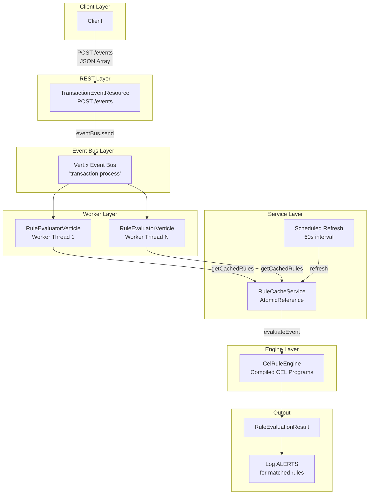
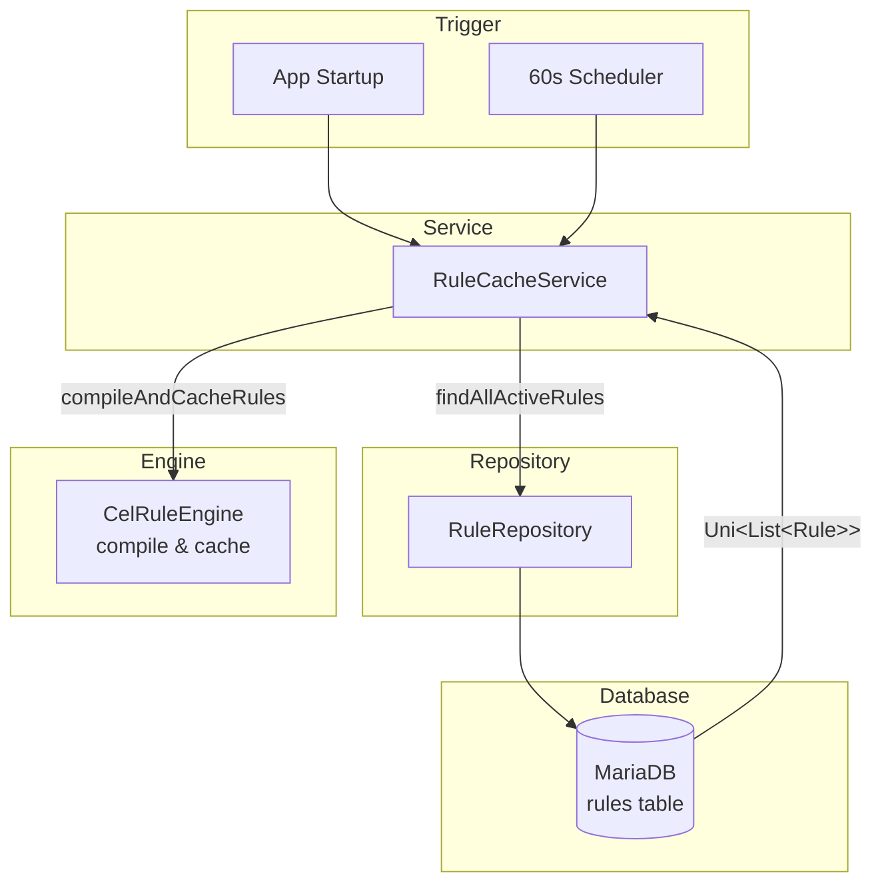
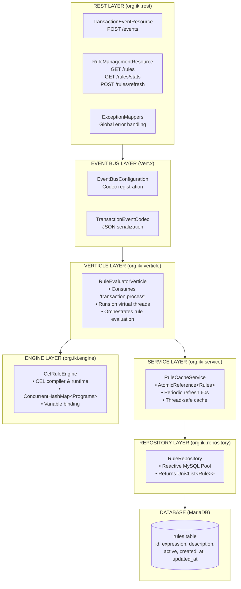
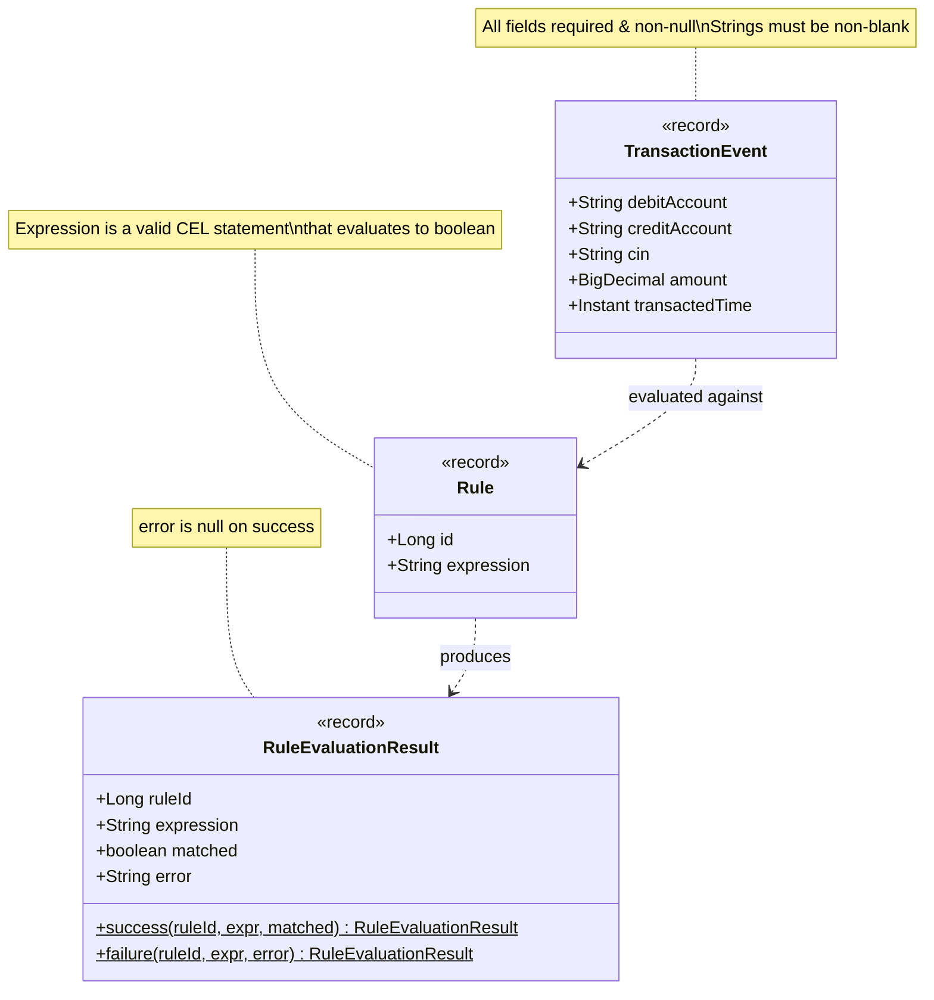

# EDIOS Knowledge Base

## Transaction Event Ingestion & Rule Evaluation System

---

## 1. System Flow Diagram

### EDIOS Architecture Flow



### Rule Cache Refresh Flow



---

## 2. Component Diagram



---

## 3. Data Models



---

## 4. API Reference

### POST /events
Ingest transaction events for rule evaluation.

**Request:**
```json
[
  {
    "debitAccount": "ACC-001",
    "creditAccount": "ACC-002",
    "cin": "CIN-12345",
    "amount": 15000.00,
    "transactedTime": "2024-01-15T10:30:00Z"
  }
]
```

**Response (202 Accepted):**
```json
{
  "dispatched": 1,
  "total": 1
}
```

**Errors:**
- `400 Bad Request` - Empty or null event list

---

### GET /rules
List all cached rules.

**Response (200 OK):**
```json
[
  {
    "id": 1,
    "expression": "amount > 10000.0"
  },
  {
    "id": 2,
    "expression": "debitAccount == creditAccount"
  }
]
```

---

### GET /rules/stats
Get rule cache statistics.

**Response (200 OK):**
```json
{
  "cachedRules": 8,
  "compiledRules": 8
}
```

---

### POST /rules/refresh
Force immediate rule cache refresh from database.

**Response (202 Accepted):**
```json
{
  "status": "refresh initiated"
}
```

---

### GET /health/ready
Readiness probe (includes rule cache health).

**Response (200 OK when healthy):**
```json
{
  "status": "UP",
  "checks": [
    {
      "name": "Rule Cache Health",
      "status": "UP",
      "data": {
        "cachedRules": 8,
        "compiledRules": 8
      }
    }
  ]
}
```

---

## 5. CEL Rule Engine

### Available Variables

| Variable | Type | Description |
|----------|------|-------------|
| `debitAccount` | STRING | Source account identifier |
| `creditAccount` | STRING | Destination account identifier |
| `cin` | STRING | Customer Identification Number |
| `amount` | DOUBLE | Transaction amount |
| `transactedTimeEpochSeconds` | INT | Unix timestamp (seconds) |

### Example CEL Expressions

```cel
// High-value transaction
amount > 10000.0

// Self-transfer detection
debitAccount == creditAccount

// Suspicious account pattern
debitAccount.startsWith("SUSP-") || creditAccount.startsWith("SUSP-")

// Combined conditions
amount > 25000.0 && debitAccount != creditAccount

// VIP customer detection
cin.startsWith("VIP-")

// Round amount detection
amount == double(int(amount)) && amount >= 1000.0

// Offshore transfer check
amount > 5000.0 && (debitAccount.contains("OFF") || creditAccount.contains("OFF"))
```

### CEL Functions Available
- String: `startsWith()`, `endsWith()`, `contains()`, `matches()`
- Math: Standard operators (+, -, *, /, %)
- Comparison: ==, !=, <, >, <=, >=
- Logical: &&, ||, !
- Type conversion: `int()`, `double()`, `string()`

---

## 6. Sequence Diagrams

### Event Ingestion Sequence

```mermaid
sequenceDiagram
    participant Client
    participant REST as TransactionEventResource
    participant EventBus as Vert.x EventBus
    participant Verticle as RuleEvaluatorVerticle
    participant Cache as RuleCacheService
    participant Engine as CelRuleEngine

    Client->>REST: POST /events (JSON Array)
    REST->>EventBus: send(event)
    REST-->>Client: 202 Accepted

    EventBus->>Verticle: consume message
    Verticle->>Cache: getCachedRules()
    Cache-->>Verticle: List&lt;Rule&gt;
    Verticle->>Engine: evaluateEvent(event, rules)
    Engine-->>Verticle: List&lt;RuleEvaluationResult&gt;
    Verticle->>Verticle: log ALERTS for matched rules
```

### Rule Refresh Sequence

```mermaid
sequenceDiagram
    participant Scheduler as 60s Scheduler
    participant Cache as RuleCacheService
    participant Repo as RuleRepository
    participant DB as MariaDB
    participant Engine as CelRuleEngine

    Scheduler->>Cache: trigger refresh
    Cache->>Repo: findAllActiveRules()
    Repo->>DB: SELECT * FROM rules WHERE active=true
    DB-->>Repo: rows
    Repo-->>Cache: Uni&lt;List&lt;Rule&gt;&gt;
    Cache->>Engine: compileAndCacheRules(rules)
    loop Each Rule
        Engine->>Engine: compile CEL expression
    end
    Engine-->>Cache: compiled programs cached
```

---

## 7. Database Schema

```sql
CREATE TABLE rules (
    id          BIGINT AUTO_INCREMENT PRIMARY KEY,
    expression  VARCHAR(1000) NOT NULL,
    description VARCHAR(500),
    active      BOOLEAN DEFAULT TRUE,
    created_at  TIMESTAMP DEFAULT CURRENT_TIMESTAMP,
    updated_at  TIMESTAMP DEFAULT CURRENT_TIMESTAMP ON UPDATE CURRENT_TIMESTAMP,

    INDEX idx_rules_active (active)
);
```

### Sample Data
| id | expression | description | active |
|----|------------|-------------|--------|
| 1 | `amount > 10000.0` | High-value transaction | true |
| 2 | `amount > 50000.0` | Very high-value alert | true |
| 3 | `debitAccount == creditAccount` | Self-transfer | true |
| 4 | `debitAccount.startsWith("SUSP-")` | Suspicious account | true |

---

## 8. Configuration Reference

### Application Properties

| Property | Default | Description |
|----------|---------|-------------|
| `app.rules.refresh-interval` | 60s | Rule cache refresh interval |
| `quarkus.http.port` | 8080 | HTTP port |
| `quarkus.http.ssl-port` | 8443 | HTTPS port |
| `quarkus.datasource.reactive.max-size` | 20 | DB connection pool size |
| `quarkus.vertx.worker-pool-size` | 20 | Vert.x worker threads |

### Environment Variables

| Variable | Description |
|----------|-------------|
| `DB_PASSWORD` | Database password (default: changeme) |
| `VERTX_EVENT_LOOPS` | Event loop threads (0 = 2 * CPU cores) |
| `VERTX_WORKER_POOL` | Worker pool size |
| `LOG_JSON` | Enable JSON logging |

---

## 9. Package Structure

```
src/main/java/org/iki/
├── model/
│   ├── TransactionEvent.java      # Transaction data record
│   ├── Rule.java                  # Rule definition record
│   └── RuleEvaluationResult.java  # Evaluation result record
├── rest/
│   ├── TransactionEventResource.java  # POST /events endpoint
│   ├── RuleManagementResource.java    # /rules endpoints
│   └── ExceptionMappers.java          # Global error handling
├── verticle/
│   └── RuleEvaluatorVerticle.java # Event bus consumer
├── engine/
│   └── CelRuleEngine.java         # CEL compiler & evaluator
├── service/
│   └── RuleCacheService.java      # Rule cache management
├── repository/
│   └── RuleRepository.java        # Database access
├── codec/
│   └── TransactionEventCodec.java # Event bus serialization
├── config/
│   ├── EventBusConfiguration.java # Codec registration
│   └── JacksonConfiguration.java  # JSON configuration
└── health/
    └── RuleCacheHealthCheck.java  # Readiness probe
```

---

## 10. Technology Stack

| Layer | Technology |
|-------|------------|
| Framework | Quarkus 3.17.0 |
| Java | JDK 21 (Virtual Threads) |
| REST | RESTEasy Reactive |
| Async | Vert.x Event Bus |
| Database | Reactive MySQL Client |
| Rule Engine | Google CEL 0.11.1 |
| JSON | Jackson |
| Health | MicroProfile Health |
| Testing | JUnit 5, REST Assured |
| DI | Arc (Quarkus CDI) |

---

## 11. Key Design Decisions

1. **Immutable Records** - All data models use Java records for thread safety
2. **Reactive Database** - Non-blocking DB access with Mutiny/Vert.x
3. **Event-Driven** - REST decoupled from processing via Event Bus
4. **In-Memory Cache** - Rules cached with periodic refresh (60s)
5. **Thread Safety** - AtomicReference for cache, ConcurrentHashMap for programs
6. **Virtual Threads** - Worker verticles run on Java 21 virtual threads
7. **Health Probes** - Readiness check validates rule cache before traffic

---

## 12. Performance Considerations

- **Non-blocking REST**: Returns 202 immediately, processes async
- **Compiled Rules**: CEL expressions pre-compiled at cache refresh
- **Connection Pooling**: 20 reactive DB connections
- **Local Delivery**: Event bus uses local-only delivery options
- **Worker Threads**: Blocking verticles run on dedicated pool

---

## 13. Error Handling

| Error | HTTP Code | Handling |
|-------|-----------|----------|
| Empty event list | 400 | Returns error response |
| Invalid event | 400 | Validation exception |
| DB connection failure | - | Logs error, cache stale |
| CEL compile error | - | Rule skipped, logged |
| CEL eval error | - | Returns failure result |
| Unknown exception | 500 | Logged, generic response |

---

## 14. Monitoring & Observability

### Health Endpoints
- `GET /health` - Overall health
- `GET /health/ready` - Readiness (includes rule cache)
- `GET /health/live` - Liveness

### Logging
- `org.iki` package: DEBUG level
- ALERT logs for matched rules
- Metrics: processed count, match count, errors, duration

### Key Metrics to Monitor
- Rule cache size
- Compiled rule count
- Event processing latency
- Match rate per rule
- Database connection pool usage